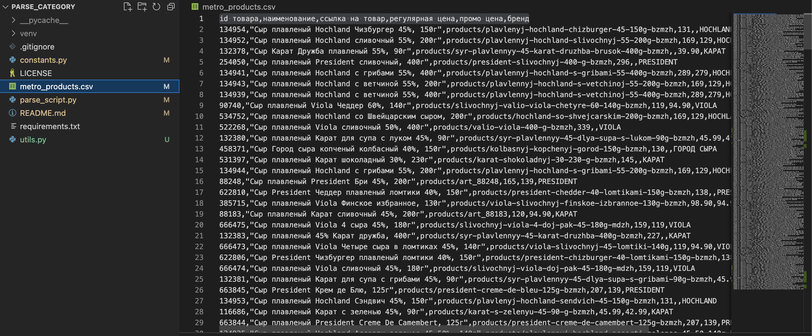

# Проект parse_category

### Описание
В этом проекте представлен парсер скрипт для получения товаров из магазина metro в городах: Москва и Санкт-Петербург из любой категории в каталоге продуктов. В результате работы срипта в течении 10 минут будет сформирован csv файл в котором представлены все товары которые есть в наличии с полями:
- id товара
- наименование,
- ссылка на товар
- регулярная цена
- промо цена
- бренд

### Технологии
- Python 3.10

### Используемые сторонние модули
- beautifulsoup4 4.12.2
- lxml 4.9.3
- requests 2.31.0

### Как запустить и протестировать проект:

Клонировать репозиторий и перейти в него в командной строке:

```
git clone git@github.com:OlegMusatov3000/parse_category.git
```

```
cd parse_category
```

Cоздать виртуальное окружение:

- Команда для Windows

```
python -m venv venv
```

- Для Linux и macOS:

```
python3.10 -m venv venv
```

Активировать виртуальное окружение:

- Команда для Windows:

```
source venv/Scripts/activate
```

- Для Linux и macOS:

```
source venv/bin/activate
```

Установить зависимости из файла requirements.txt:

```
python -m pip install --upgrade pip
```

```
pip install -r requirements.txt
```

Запустить скрипт:

```
python parse_script.py
```

В командной строчке вас попросят указать ссылку на категорию которую хотите спарсить. Можете нажать 1 и будут получены все плавленные сыры в Санкт-Петербурге и Москве:

```
Введите правильное имя категории для парсера пример:

category/molochnye-prodkuty-syry-i-yayca/syry/plavlenye 

Вы можете скопировать его из адресной строки на странице со списками
товаров, можете нажать 1 и будет применена категория из примера:
```

Попейте кофе/чай т.к. парсер будет выполняться около 10 минут

Когда скрипт будет завершен будет создан/обновлен файл metro_products.csv со всеми товарами из этой категории которые есть в наличии:

- 

### Небольшое примечание
Этот readme был написан для удобного и понятного тестирования проекта. Пожалуйста оцените мои старания и предоставьте обратную связь в TG что можно было бы улучшить и чего не хватает для удовлетвория ваших ожиданий

- Tg: @OlegMusatov

При проверки корректности работы скрипта учитывайте что за время работы скрипта, могли добавиться новые товары или закончиться старые :)

### Автор проекта 
- Олег Мусатов
- Tg: @OlegMusatov
